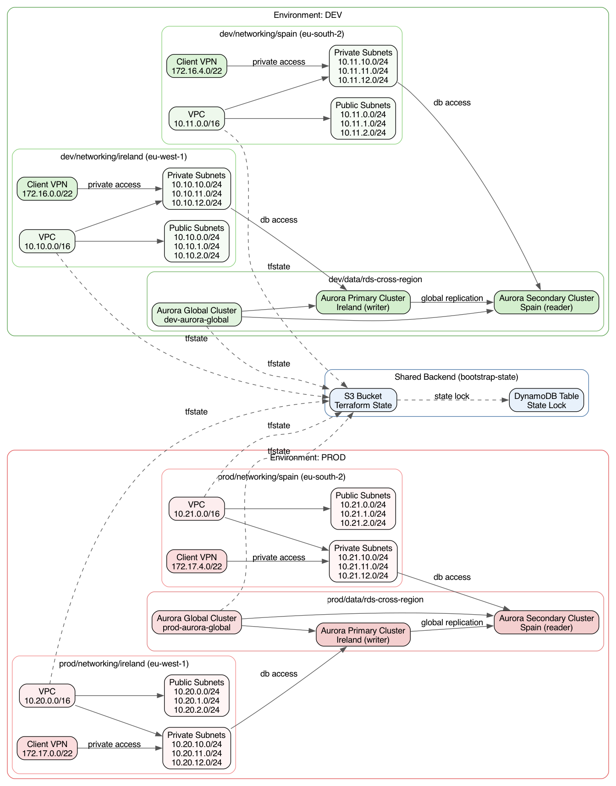
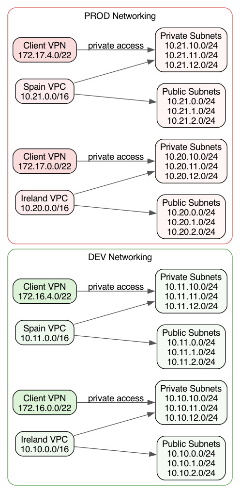
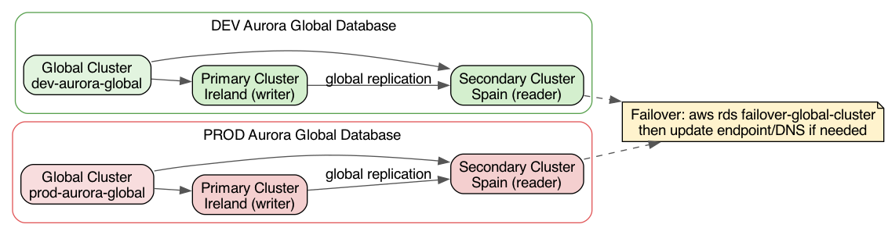

# aws-multi-region

Terraform infrastructure with two environments (`dev` and `prod`), split by region.

## Structure

```text
bootstrap-state/
environments/
  dev/
    networking/
      ireland/
      spain/
    data/
      rds-cross-region/
  prod/
    networking/
      ireland/
      spain/
    data/
      rds-cross-region/
```

## Architecture

### Overview



### Networking



### RDS / Aurora Global



## CIDRs (non-overlapping)

- `dev`:
  - Ireland: `10.10.0.0/16`
  - Spain: `10.11.0.0/16`
- `prod`:
  - Ireland: `10.20.0.0/16`
  - Spain: `10.21.0.0/16`

## 1) Create shared backend (S3 + DynamoDB)

```bash
cd bootstrap-state
terraform init
terraform apply
```

Use outputs:
- `tfstate_bucket_name`
- `tfstate_lock_table_name`
- `backend_region`

## 2) Configure backend files

Fill with backend values:
- `environments/dev/networking/ireland/backend.hcl`
- `environments/dev/networking/spain/backend.hcl`
- `environments/prod/networking/ireland/backend.hcl`
- `environments/prod/networking/spain/backend.hcl`
- `environments/dev/data/rds-cross-region/backend.hcl`
- `environments/prod/data/rds-cross-region/backend.hcl`

## 3) Deploy networking first

```bash
cd environments/dev/networking/ireland && terraform init -backend-config=backend.hcl && terraform apply
cd ../spain && terraform init -backend-config=backend.hcl && terraform apply

cd ../../../prod/networking/ireland && terraform init -backend-config=backend.hcl && terraform apply
cd ../spain && terraform init -backend-config=backend.hcl && terraform apply
```

## 4) Deploy Aurora global database

```bash
cd environments/dev/data/rds-cross-region
terraform init -backend-config=backend.hcl
terraform apply

cd ../../../prod/data/rds-cross-region
terraform init -backend-config=backend.hcl
terraform apply
```

This stack creates:
- Aurora global cluster
- primary Aurora cluster in Ireland (`eu-west-1`)
- secondary Aurora cluster in Spain (`eu-south-2`)

Failover note:
- use Aurora Global Database failover/switchover operations
- then update app endpoint/DNS if your apps are pinned to old writer endpoint
